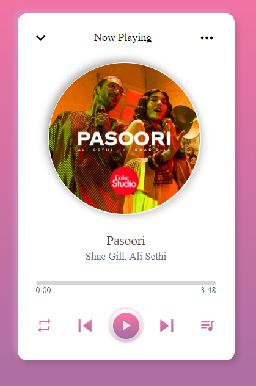
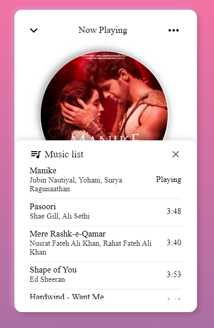
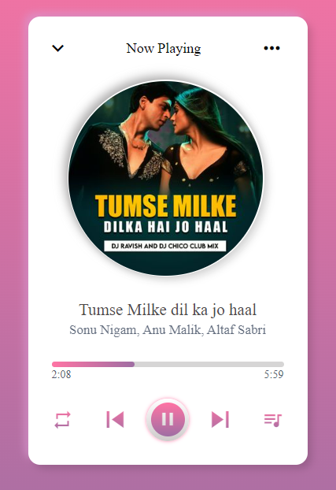

# Music_Player_Application

 

A simple music player webpage made using HTML, CSS, and JavaScript for self-learning purpose.
  

---

## Demo

 

You can view the demo of this application by following <a href="https://music-player-application.netlify.app/" target="_blank">this link</a> . Although I have also provided the screenshots below of exactly how it looks like. 
For this one, I have used <a href="https://app.netlify.com" target="_blank">Netlify</a> to host the quiz.
 

Here is the ss of the application

 

---

## Features

 

- Easy to use music player application.

- Simple and Intuitive UI design, i.e.&ensp;**_less code but more attractive_**.

- Editable `music-list.js` file along with songs and images folder respectively to play songs according to your mood.

- Backend can be connected so that more songs can be added directly to the music list without actually changing anything in the code.

- You can also change the song to play in three different loops, i.e. Playlist looped, Song looped and Playback shuffled.

- You can play the desired song directly from the music list present in the music-player itself.
    

---

## Usage

 

1. Clone the repository:

> git clone https://github.com/priyanshu-baran/Music_Player_Application.git

2. Navigate to the cloned directory and open the index.html file in your browser.

> cd Music_Player_Application

> **_Recommend:_** I will recommend using [Live Server Extension](https://marketplace.visualstudio.com/items?itemName=ritwickdey.LiveServer) here as it will help you a lot while working with .htm or .html files.

3. Play the song by clicking the "Play" button and then enjoy with your brand new personal music player.
     

---

## Contributing

 

If you would like to contribute to this repo `Music Player Application`, please fork the repository and submit a pull request with your changes. Contributions are welcome and encouraged!
  

---

## Like this project? 🤩

 

If you are feeling generous, buy me a coffee...!!! ☕ 

  

---

### Happy Coding...!! 👨🏽‍💻👨🏽‍💻
